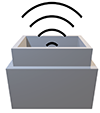
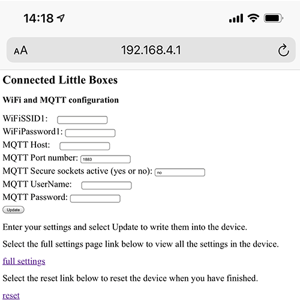
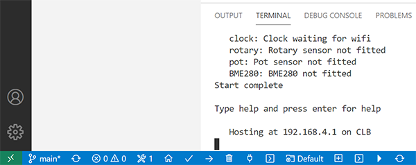

# Connected Little Boxes - box-code

This is the repository for all the code that runs inside the connected box. This code provides the interface to the sensors, settings managment, MQTT connection, a configuration web site and terminal connection. 

The box code is common to all the different kinds of boxes. You configure the settings in the code to enable different configurations.

You can create your own code for sensors and outputs and the framework will manage all the settings storage and management. There is also a flexible command language based on JSON that is used to tell the boxes what to do. Any box can send a message to any other box (as the name of the project implies). 

While you can write programs to tell the boxes what to do it is possible to create networks of connected devices without writing any code. 
# Get started
The code can run on either an ESP8266 or ESP32. You can select the build target in the platformio.ini file.There are also build options for M5Stack and M5Stick devices. To build and deploy to a device connect it to your computer and perform a deploy from Platform IO. The default device configuration is for the Wemos D1 Mini.

The first thing you will need to do is deploy the software to a device and then you can start telling your connected little box what to do.

1. Install Visual Studio Code on your development device (Windows PC, Mac or Raspberry Pi).
1. Install the PlatformIO plugin for Visual Studio Code.
1. Clone this code repository onto your computer.
1. Build the framework for your chosen platform (ESP32 or ESP8266)

# Configure the device using your phone
When a new device is first powered up it detects that there are no WiFi settings configured and it starts an access point called **CLB**. You can connect to this access point with your phone or laptop. If your phone can use the camera configure a WiFi connection you can connect to the device using the following QR code:


When you have connedted to the device you must browse to the address of the configuration server which is **192.168.4.1** The QR code for this adress is as follows:


Your phone will display the configuration web page for WiFi and MQTT. 



Type in the settings for the WiFi connection that you want the device to use. 

Now enter the details for the MQTT server the device will be using. If the server doesn't require a username or password you can leave them blank. If you want to use a secure MQTT connection you can change the "MQTT Secure sockets active" item to "yes" and update the port number to 8883 if this is appropriate. 

If you do not have an MQTT server of your own you can use a free open one, for example the one at **`broker.hivemq.com`** 

**Note that if you use an open MQTT server any messages that you send will be visible to all users on that server and anyone else on the server could send messages addressed to your device. You should only use an open server for testing. If you only want to use your Connected Little Boxes around your house you can use a Raspberry Pi running Mosquitto as an MQTT server for your home netowrk.**

When you have entered your settings press the Update button to store them in your device. When your settigns have been saved you can select the **reset** link to reset the device. It will then connect to the network using the credentials that you have entered. 
# Configure the device using your computer
Another way to configure a device once you have deployed the code is to use the PlatformIO terminal program. You can start this by clicking the serial connection icon you can find at the bottom left hand side of Visual Studio:


**Note that you might find that there are two terminal icons on the bottom row. I'm sorry about this, the one you want is the leftmost one, you can see it on the screenshot below.**

The terminal should automatically connect to your device and open a window at the bottom of the Visual Studio Code display. 



The terminal connection to the device will echo the keys that you enter and you can use the backspace key to move back down the line if you mis-type anything. Press the Enter key to submit the command to the device. When the device is restarted it will go through the startup sequence shown below. This device has automatically started a WiFi access point for configuration. 
```
Connected Little Boxes Device
www.connectedlittleboxes.com
Version 1.0.0.9 build date: Mar  3 2021 14:45:58
Reset reason: External system reset

Settings Setup
   settings occupy 3900 bytes of EEPROM
   device:CLB-302dd0
   settings loaded OK

Starting processes
   pixels:  PIXEL OK
   statusled:  Status led lit
   inputswitch:  Input switch stopped
   messages:  Messages stopped
   console:  Console OK
   WiFi: Starting config access point at CLB:  WiFi connection starting AP
   MQTT:  MQTT Starting
   controller:  Controller active
   servo:  Servo off
   registration:  Waiting for MQTT
   Settingswebserver:  Web server Ready
   max7219:  Messages stopped
   printer:  Printer off
   hullos:  HullOS stopped
Starting sensors
   PIR: PIR sensor not fitted
   button: Button sensor not fitted
   clock: Clock waiting for wifi
   rotary: Rotary sensor not fitted
   pot: Pot sensor not fitted
   BME280: BME280 not fitted
Start complete

Type help and press enter for help

   Hosting at 192.168.4.1 on CLB
```
You can set an individual setting by assigning a new value to it. These are the settings that you can start with for the MQTT. 

```
wifissid1=your WiFi ssid
wifipwd1=your WiFi password

mqttdevicename=CLB-302dd0
mqttactive=yes
mqtthost=your MQTT host name
mqttport=1883
mqttsecure=no
mqttuser=your MQTT username
mqttpwd=your MQTT password
```
Each value that you enter is stored in the device for future use. You can view the contents of any setting just by entering the setting name and pressing Enter.
## Viewing settings
The dump command shows you the content of multiple settings. If you just enter the command "dump" you will see all the setting values. The dump command can also be followed by a filter so that only settings containing the filter string will be displayed:

```
Processing: dump wifi 

switchinputwificonfig=0
wifiactive=yes
wifissid1=
wifipwd1=******
wifissid2=
wifipwd2=******
wifissid3=
wifipwd3=******
wifissid4=
wifipwd4=******
wifissid5=
wifipwd5=******
```
The command above shows the WiFi settings. Note that the password values are not displayed using the Terminal. 

## More commands
To see what other commands are availalbe type in the command **help**  and press enter. 
```
These are all the available commands.

    help - show all the commands
    host - start the configuration web host
    settings - show all the setting values
    dump - dump all the setting values
    commands - show all the remote commands
    commandsjson - show all the remote commands in json
    save - save all the setting values
    sensors - list all the sensor triggers
    status - show the sensor status
    storage - show the storage use of sensors and processes
    pirtest - test the PIR sensor
    rotarytest - test the rotary sensor
    pottest - test the pot sensor
    colours - step through all the colours
    listeners - list the command listeners
    clearalllisteners - clear all the command listeners
    clearsensorlisteners - clear the command listeners for a sensor
    restart - restart the device
    hullos - HullOS commands
    sprites - dump sprite data
    clear - clear all seeings and restart the device
```
For full command descriptions consult the device manual.


# MQTT addressing
Each box has a unique name which is used to address it on an MQTT installation. The name is made up of three elements which are managed by the following settings.
```
MQTT Device name [mqttdevicename]: CLB-eab998
MQTT Topic prefix [mqttpre]: lb
MQTT Subscribe topic [mqttsub]: command
```
The **MQTT Device Name** is created from the processor ID the particular chip. It should be unique on a given installation. **The MQTT Topic prefix** is placed in front of any address that is used by the box. By default the string is set to "lb".

The **MQTT Subscribe topic** is used by the box to receive messages. A box will subscribe to this topic and act on any commands that are received on it. A box will also use this topic to publish commands to other box.

If you use the default settings (which I would advise) you can address distant boxes by just putting their MQTT Device Name value in the **to** part of a command:
```
{"process":"pixels", "command":"setnamedcolour","colourname":"green","pixelSpeed":20,"to":"CLB-eab998"}
```
The above command would set the pixels green on the box with the MQTT Device name **CLB-eab998**. This would send the command to the topic string below, which is what the destination device would be subscribed to:
```
lb/command/CLB-eab998
```
There are some other MQTT topic values defined in the device which are for future expansion.
## Note
The present version of the firmware does not handle empty Topic Prefix or Subscribe topic values. So please make sure that you put text into these fields. This will be fixed in a later release. 


